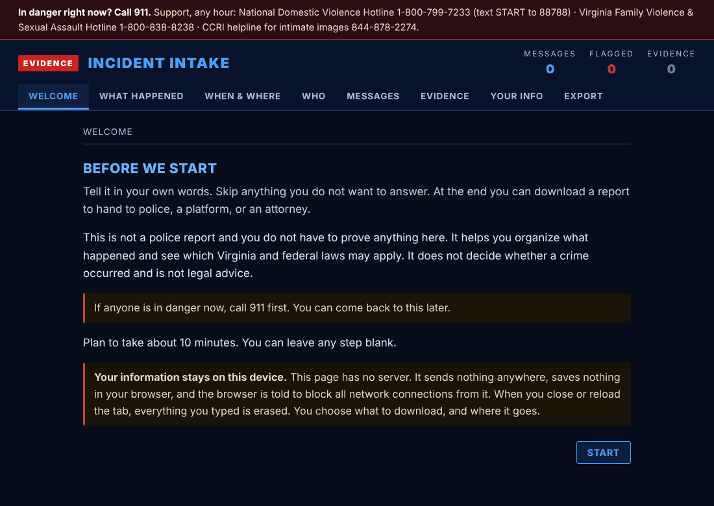
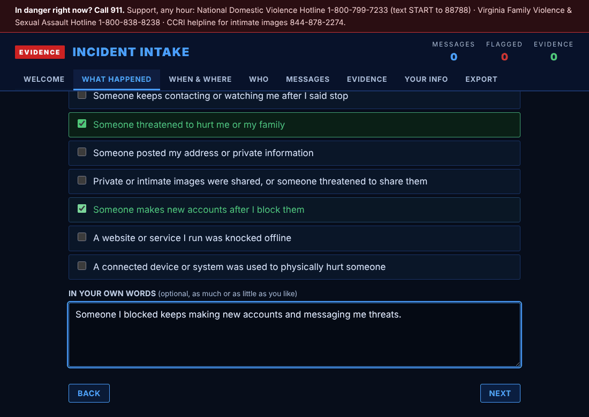

# Guided intake form (`web/intake.html`)

`web/intake.html` walks someone through what happened in plain language, one short step at a time:

1. Safety check and welcome (911 and three support hotlines stay pinned at the top).
2. What happened: tick scenarios such as "Someone keeps contacting or watching me after I said stop", plus optional free text.
3. When and where, with an "ongoing" box.
4. Who is involved, whether they were told to stop or blocked, and when.
5. Messages received. Pasted messages are scanned in the browser for threat and harassment behaviors.
6. Impact, how you felt at the time (tick feelings and add your own words), evidence already on hand, what has already been done, and an optional evidence fingerprinter: choose files and the browser computes a SHA-256 for each (nothing is uploaded; files over 100 MB are skipped with a pointer to the CLI).
7. Your details for the report (name, phone, email, address, best time) and case details (agency, detective, local case number, IC3 number); all optional and kept on the device. Then what you want the agency to do (case number, preservation request, protective-order information, victim services, contact).
8. Results: likely attack types (editable), then **Send it to law enforcement**.

Every question can be skipped. The page makes no network requests and stores nothing; closing the tab erases it.

## Sending the report

Pick the destination (local police or sheriff, Virginia State Police, FBI IC3, FBI tips, or a platform's safety team). The page lists the steps for that route and preselects a format. Three formats, modeled on the original Incident Logger:

- **Law enforcement report**: To / Re / From header (agency, detective, case number, IC3 number, reporter contact), summary, incident log, evidence with fingerprints, requested actions, declaration and signature line.
- **IC3 complaint narrative**: complaint type, overview, applicable statutes, incident summary, priority exhibits (the three highest-weight flagged incidents), full incident log, and a 2703(f) preservation request listing each platform. Paste it into the IC3 details field.
- **Full incident log**: one `INCIDENT REPORT - INC-00n` block per incident (date, subject account, content, legal flags, actions taken, running total since the stop request, applicable statutes).

All three end with **KEY - PLAIN LANGUAGE (FOR NON-LAWYERS)** (what each flag and statute means) and the support hotlines. Buttons: download .html, download .txt, **Email it** (opens the mail app with a shortened version and a reminder to attach the .html; hidden for IC3 and FBI tips, which use web forms), copy, and print. Under "For the incident log (advanced)" is a .json file for `import`, which ignores the reporter's contact details.

Each pasted message becomes one numbered incident. Its flags are word matches only, and its statutes come from the flags it triggered. The statute list is labelled as the reporter's belief for the agency's review, not a charging recommendation. The files contain everything the person typed, including contact details, so they should be shared only with the chosen agency. Samples (all fictional) are in `examples/`.

Load the advanced .json file into the tamper-evident log:

```bash
va-incident-mapper import incident-intake.json
va-incident-mapper import incident-intake.json --evidence ./screenshot.png
```

Import re-runs the language analysis in Python, so the stored result comes from the same code as every other entry.

If you change the data tables, rebuild the form so it stays in sync (a test enforces this):

```bash
python tools/build_intake.py
```

## Screenshots



