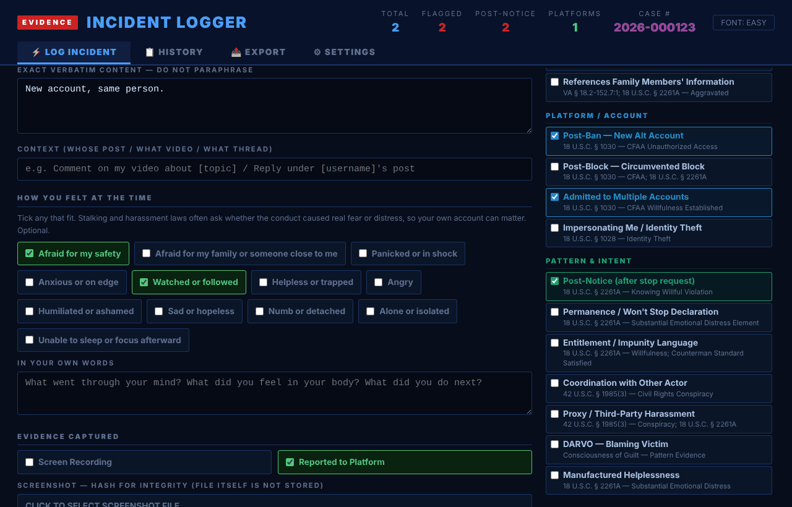
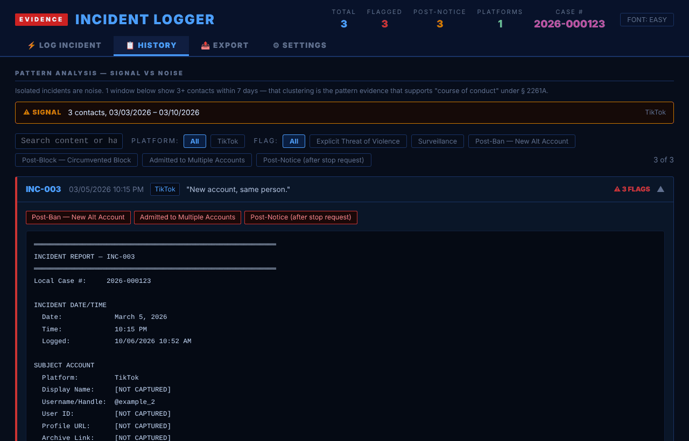
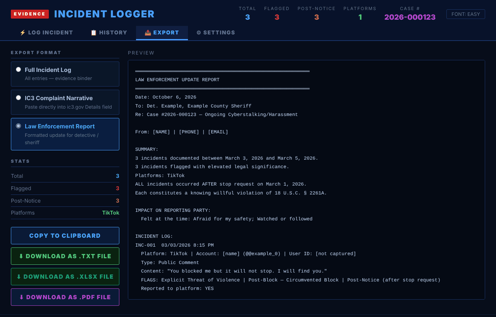
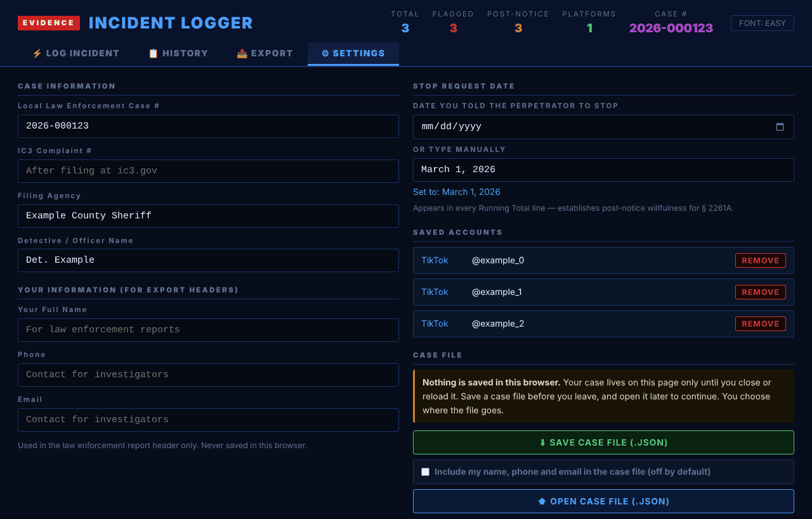

# Incident Logger (`web/logger.html`)

`web/logger.html` is the dashboard for logging incidents as they happen. Open it in a browser. It has four tabs:

- **Log Incident**: date and time, platform and incident type, subject account (name, handle, permanent user ID, profile URL, archive link), the exact words, context, how you felt at the time, evidence (screen recording, reported to platform, a screenshot fingerprint computed in the browser, report confirmation number), and 26 legal flags in six groups. A side panel lists the statutes that will apply and the running total of contacts since the stop request.
- **History**: pattern analysis that flags three or more contacts within seven days, search, platform and flag filters, and for each incident copy, download and delete.
- **Export**: choose Full Incident Log, IC3 Complaint Narrative or Law Enforcement Report. Copy to the clipboard, or download as .txt, .xlsx (incidents, case info and a plain-language key) or .pdf. A live preview shows exactly what you will get.
- **Settings**: case information (case number, IC3 number, agency, detective), your information for report headers, the stop-request date, saved accounts, an audit log and a clear-all button.

**Saving.** Nothing is stored in the browser. Settings, then **Save case file** downloads a .json of the whole case (your name, phone and email are left out unless you tick the box). **Open case file** loads it again. It also opens backups made by the earlier Incident Logger and the .json from the guided form, which becomes one incident per pasted message with its flags. The page warns before you close it with unsaved work.

**Font.** The FONT button switches between an easier-to-read font and the original typewriter font.

The legal-flag labels and plain-language key were corrected against statute text on 2026-10-07 and are kept separately from the statute table behind the guided form, so update both when a statute changes. See `docs/data-and-limits.md` for what changed.

## Screenshots

All screenshots use fictional data.

## Rebuilding

`web/logger.html` is generated. Edit `web/logger.template.html` or `web/logger.core.js`, then run `python tools/build_logger.py`. A test fails if the built file is out of sync.
